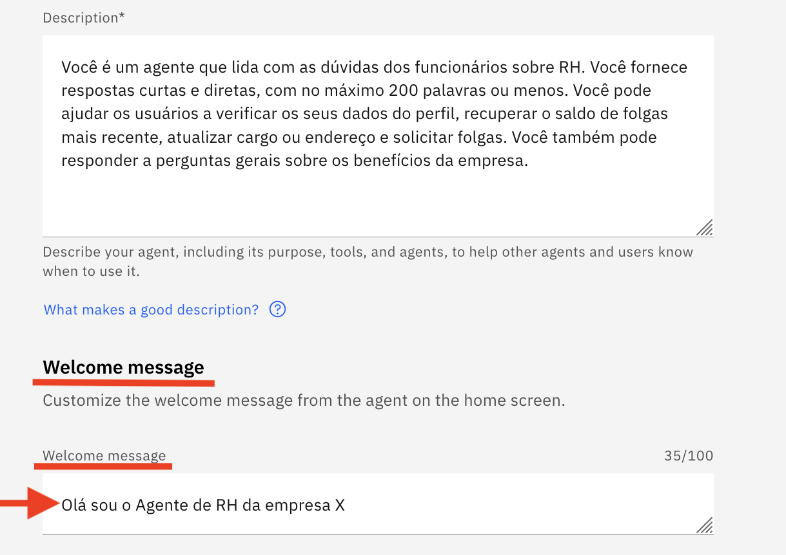
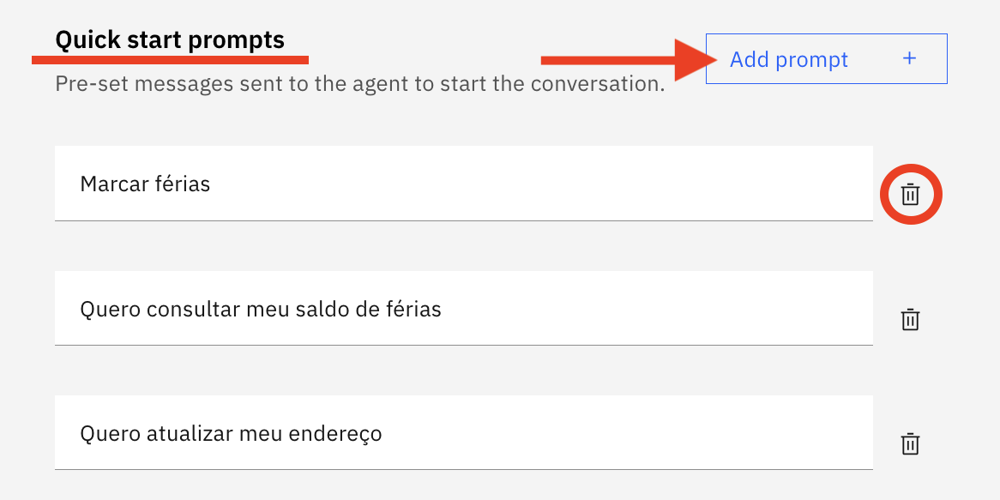

# 🧑‍💼 AskHR: Automatize tarefas de RH com a IA da Agentic

## Sumário

- [🧑‍💼 AskHR: Automatize tarefas de RH com a IA da Agentic](#-askhr-automatize-tarefas-de-rh-com-a-ia-da-agentic)
  - [Sumário](#sumário)
  - [Descrição do caso de uso](#descrição-do-caso-de-uso)
  - [Arquitetura](#arquitetura)
  - [Pré requisitos](#pré-requisitos)
  - [Instruções:](#instruções)
    - [Abrir Agent Builder](#abrir-agent-builder)
    - [Criando um Agente de RH](#criando-um-agente-de-rh)
    - [Teste o Agente de RH em Preview](#teste-o-agente-de-rh-em-preview)
      - [Testar o Agente de RH no Chat](#testar-o-agente-de-rh-no-chat)
    
## Descrição do caso de uso

Este caso de uso tem como objetivo desenvolver e implementar um agente AskHR utilizando o <b>IBM watsonx Orchestrate</b>, conforme ilustrado no diagrama de arquitetura abaixo. Esse agente vai permitir que os colaboradores interajam com os sistemas de RH e acessem informações de forma simples e eficiente, usando IA conversacional.

No laboratório, vamos construir um agente de RH no <b>watsonx Orchestrate</b>, aproveitando ferramentas e conhecimento externo para se conectar a um sistema de Gestão de Capital Humano simulado. Esse agente será capaz de recuperar informações relevantes de documentos para responder às perguntas dos usuários e também permitir que eles visualizem e gerenciem seus próprios perfis.

## Arquitetura


## Pré requisitos

- Verifique com seu instrutor se **todos as aplicações** estão funcionando antes de continuar.
- Confirme se você tem acesso ao ambiente techzone correto para este laboratório.
- Confirme que você fez o dowload do arquivo LABS.zip 


## Instruções:

### Abrir Agent Builder

Faça login na IBM Cloud (cloud.ibm.com). Navegue até o menu hambúrguer no canto superior esquerdo, depois até Lista de Recursos. Abra a seção de `IA/Machine Learning`. Você deve ver um serviço **watsonx Orchestrate**, clique nele para abrir.


Clique no botão azul "Launch watsonx Orchestrate" como ilustrado na imagem abaixo:


Bem vindo ao <b>watsonx Orchestrate</b> 💙 

Abra o menu hambúrguer, clique `Agent Builder`


### Criando um Agente de RH

1. Clique em **Create agent +**:


2. Selecione **Create from scratch**, de o nome ao seu agente, por exemplo, `Agente de RH`, e preencha o campo **Description** conforme mostrado abaixo:

```
Você é um agente que lida com as dúvidas dos funcionários sobre RH. Você fornece respostas curtas e diretas, com no máximo 200 palavras ou menos. Você pode ajudar os usuários a verificar os seus dados do perfil, recuperar o saldo de folgas mais recente, atualizar cargo ou endereço e solicitar folgas. Você também pode responder a perguntas gerais sobre os benefícios da empresa.
```  
Clique em **Create**:


Na próxima página:

Em `Model`, mantenha o modelo padrão, não é necessário alterar 

3. Selecione **Default** na seção **Agent style**.


Ainda durante a etapa de definição do tipo de agente, você também pode configurar uma mensagem de boas vindas que será exibida na interface para o usuário, como mostrado na imagem abaixo.

<b>Essa mensagem é opcional. Você pode escrever algo como:</b> 

`Olá! Sou o Agente de RH da empresa X`

Ou simplesmente deixar em branco para manter as mensagens padrão.



A seguir,podemos definir mensagens de atalho. Essas mensagens serão exibidas para o usuário como botões na interface, funcionando como atalhos para ações.

Por exemplo:

`marcação de férias`

`consultar saldo de férias`

`atualização de endereço`

Você pode criar esses botões clicando em `Add prompt +` e removê-los clicando no ícone de lixeira.

Esse passo também é opcional.
Para que essas opções apareçam na telinha de preview do lado direito da tela, use o ícone de restart para atualizar a interface. <b> Não é necessário sair da página. </b>



4. Role a tela para baixo até a seção **Knowledge**. Clique em **Choose knowledge**.


5. Clique em  **Upload files** e depois **Next**


6. Clique e arraste o arquivo de Benefícios para funcionários (Arquivo `Employee-Benefits_ptbr.pdf` dentro da pasta "1. AskRH" gerada após descompactar o LABS.zip) e clique em **Next**:

  

7. Copie a seguinte descrição na seção **Description** e clique em **Save**:

```
Esta base de conhecimento aborda os benefícios dos funcionários da empresa, incluindo licenças-maternidade, política de animais de estimação, acordos de trabalho flexíveis e pagamento de empréstimos estudantis.
``` 

8. Role para baixo até a seção **Toolset**. Clique em **Add tool +**:


9. Selecione **Add from file or MCP server**:


10. Selecione **Import from file**:


11. Arraste e solte ou clique para carregar o arquivo **hr.yaml** (Arquivo `hr.yaml` dentro da pasta "1. AskRH" gerada após descompactar o LABS.zip) , então clique em **Next**:

  

12. Selecione todas as operações e clique em **Done**:


13. Role para baixo até a seção **Behavior**. Insira as instruções abaixo no campo **Instructions**:

```
Use sua base de conhecimento para responder a perguntas gerais sobre benefícios para funcionários.

Use as ferramentas para obter ou atualizar informações específicas do usuário.

Quando o usuário solicitar a exibição de dados de perfil, a verificação do saldo de folgas, a atualização do cargo/endereço ou a solicitação de folga pela primeira vez, primeiro pergunte o nome do usuário, depois invoque a ferramenta e use o mesmo nome em toda a sessão, sem solicitá-lo novamente.

Quando o usuário solicitar folga, converta as datas para o formato AAAA-MM-DD. Por exemplo, 22/05/2025 deve ser convertido para 2025-05-22 antes de passar a data para a ferramenta post_request_time_off.
 ```


14. Ative o botão de alternância para **Chat with documents**. Selecione **None** em **Citations show in webchat**. Ative o botão de **Show agent**. Clique em **Deploy** no canto superior direito para implantar seu agente:


### Teste o Agente de RH em Preview

Teste seu agente no chat de pré visualização à direita, fazendo as seguintes perguntas e validando as respostas. Elas devem ser semelhantes às mostradas nas capturas de tela abaixo:

<b> IMPORTANTE: </b> Quando o agente perguntar seu nome você deve perguntar ao Agente de Suporte lá na página do git.

```
Qual é a política para animais de estimação? 
```


```
Mostrar os dados do meu perfil.
Gostaria de atualizar meu título. 
```


```
Atualize meu endereço.
Qual é o meu saldo de folgas?
```


```
Solicitar folgas.
Mostrar os dados do meu perfil.
```


#### Testar o Agente de RH no Chat

- Clique no menu de hambúrguer no canto superior esquerdo e depois clique em **Chat**:


> Certifique-se que o **HR Agent** está selecionado. 

Agora você pode testar seu agente (Pode repetir as mesmas perguntas do teste anterior)


