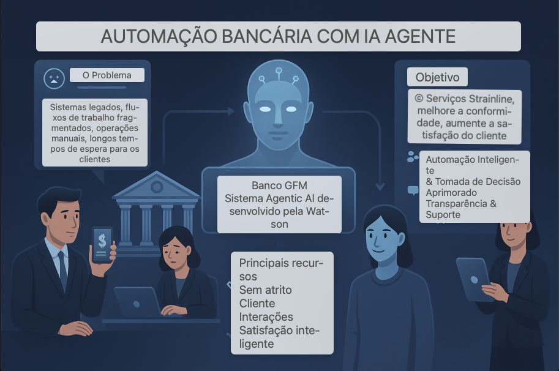

# 🏦  Automação Bancária com Agentic AI

## 🤔 O Problema/Caso de uso/Desafios Operacionais do GFM Bank

O **GFM Bank** enfrenta desafios significativos devido à dependência de processos bancários tradicionais e manuais.

- **Longos tempos de espera**:
  - 20 a 30 minutos para falar com um caixa.
  - Até **45 minutos adicionais** para aprovações de back-office.
- **Impacto em períodos de pico** e em solicitações complexas, como:
  - Aprovação de cheque especial.
  - Reversão de taxas.
- **Serviços limitados ao horário comercial**, reduzindo acessibilidade e conveniência.
- **Equipe sobrecarregada** com tarefas repetitivas, causando:
  - Ineficiências operacionais.
  - Experiências inconsistentes para os clientes.

## 🎯 Objetivo

O **GFM Bank Agentic AI System**, criado com o **IBM Watsonx Orchestrate**, tem como objetivo **modernizar as operações bancárias** por meio da implantação de uma rede de agentes de IA inteligentes e colaborativos.

<b>Principais Benefícios</b>

✅ **Automatização de tarefas rotineiras**, reduzindo carga operacional.

✅ **Agilidade em fluxos de trabalho complexos**, como aprovações e reversões.

✅ **Atendimento rápido, confiável e disponível 24/7**, garantindo conveniência para os clientes.

✅ **Conformidade com regulamentos bancários**, mantendo segurança e governança.

### 💡 Principais Recursos

* **Interações sem atrito com o cliente**
  - Suporte alimentado por IA **24 horas por dia, 7 dias por semana**, para consultas de saldo, transferências, solicitações de cheque especial e muito mais.
  - Interface de conversação intuitiva que orienta os usuários em tarefas bancárias complexas.

* **Automação Inteligente e Tomada de Decisão**
  - Validação automatizada de transações e solicitações de cheque especial com base no histórico da conta e nas regras da política.
  - Encaminhamento inteligente de solicitações para o agente de IA apropriado (por exemplo: **Teller**, **Backoffice**, **Informações do Produto**).

* **Transparência e Suporte Aprimorados**
  - Respostas instantâneas e precisas às consultas dos clientes usando uma base de conhecimento habilitada para **RAG**.
  - Fluxos de trabalho claros e guiados que reduzem a confusão e aumentam a confiança do cliente.

## 📈 Valor para o Negócio

### Para clientes
* Acesso a serviços bancários **a qualquer hora, em qualquer lugar**
* **Processamento rápido** de transações e aprovações
* Menor necessidade de visitar agências físicas
* Experiência bancária **personalizada e conversacional**
* Resolução mais rápida de problemas como **cheque especial** e **reversões de taxas**

### Para Funcionários do Banco e Operações
* **Redução significativa** na carga de trabalho manual
* Mais tempo para a equipe se concentrar em **necessidades complexas e de alto valor**
* **Verificações automatizadas** de conformidade e tomada de decisão
* Melhor **eficiência operacional** e **satisfação do cliente**
* Solução **escalável**, adaptando-se à demanda sazonal e ao volume de clientes

## Arquitetura

## 📝 Laboratório prático passo a passo

👉 [Clique aqui](/usecases/banking-backoffice/assets/hands_on_lab_banking_automation.md) para acessar as instruções detalhadas aqui e começar agora mesmo!
