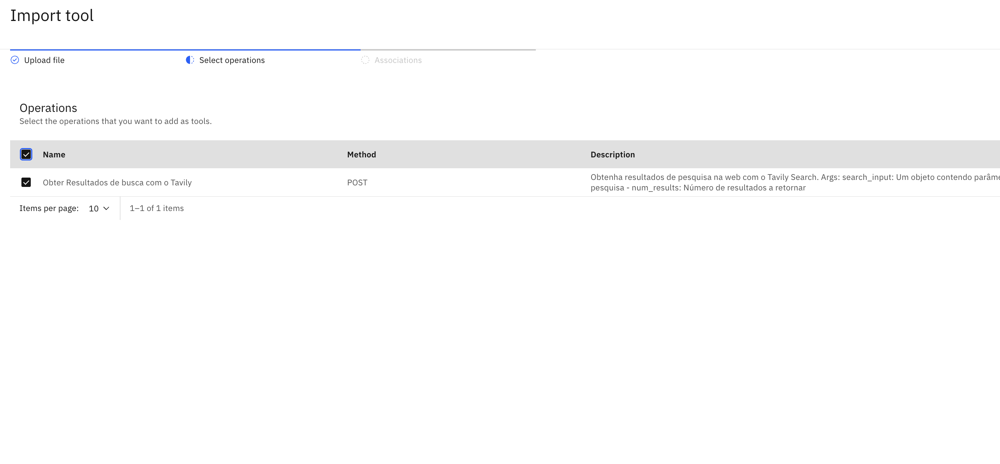

# 👨🏻‍💻 Caso de uso: Agente Analista Financeiro

## Sumário
- [👨🏻‍💻 Caso de uso: Agente Analista Financeiro](#-caso-de-uso-agente-analista-financeiro)
  - [Sumário](#sumário)
  - [Descrição do caso de uso](#descrição-do-caso-de-uso)
    - [🎯 Objetivo](#-objetivo)
  - [Arquitetura  ](#arquitetura--)
  - [Pré requisitos](#pré-requisitos)
  - [watsonx Orchestrate](#watsonx-orchestrate)
    - [Acessando o watsonx Orchestrate](#acessando-o-watsonx-orchestrate)
  - [Criação de Agente Analista Financeiro](#criação-de-agente-analista-financeiro)
    - [Configuração do agente com base de conhecimento](#configuração-do-agente-com-base-de-conhecimento)
  - [Criação e configuração do agente de API financeira](#criação-e-configuração-do-agente-de-api-financeira)
  - [Criação e configuração do agente de pesquisa na Web](#criação-e-configuração-do-agente-de-pesquisa-na-web)
  - [Juntando tudo - Colaboração completa do agente ](#juntando-tudo---colaboração-completa-do-agente-)
  - [Experimente os agentes em ação usando a interface de bate papo do Watsonx Orchestrate](#experimente-os-agentes-em-ação-usando-a-interface-de-bate-papo-do-watsonx-orchestrate)
  - [Conclusão](#conclusão)

## Descrição do caso de uso

A **Blue Aurum Financial** planeja implementar um **Agente de Pesquisa Financeira com IA** para apoiar sua equipe de analistas, acelerando pesquisas e identificando oportunidades de investimento de alto valor.

### 🎯 Objetivo

Criar uma solução baseada em agentes que auxilie os analistas nas seguintes tarefas:

- **Analisar relatórios financeiros** e extrair informações relevantes.
- **Gerar análises comparativas** entre diferentes empresas com base em seus relatórios.
- **Pesquisar informações públicas**, incluindo detalhes sobre a empresa, notícias recentes e relatórios de analistas.
- **Integrar ferramentas internas** para recuperar métricas financeiras via APIs.
- **Produzir relatórios consolidados** com descobertas e análises.

Ao automatizar essas tarefas, a empresa busca tornar o processo de pesquisa **muito mais ágil**, acelerando a identificação de novas oportunidades de investimento.


## Arquitetura  <a id="architecture"></a>


## Pré requisitos

Para realizar as etapas desta parte do laboratório prático, você precisa ter acesso ao <b>watsonx Orchestrate</b> e ao </b> watsonx.ai</b>, que já foram disponibilizados como parte da preparação para este bootcamp.

✅ Certifique-se também de ter baixado o arquivo `LABS.zip` antes de começar.

## watsonx Orchestrate

Conforme mostrado na [Arquitetura]((images/banking-fra-architecture.png)), a maior parte dos agentes da solução será construída e implementada no IBM watsonx Orchestrate.

Os agentes de IA são componentes autônomos capazes de executar tarefas, tomar decisões e interagir com o ambiente. No watsonx Orchestrate, eles são fundamentais para criar sistemas inteligentes, dinâmicos e adaptáveis, que respondem rapidamente a mudanças nas condições e necessidades do negócio.

### Acessando o watsonx Orchestrate

Para acessar o <b>watsonx Orchestrate</b>, siga estas etapas:

1 - Se você ainda não estiver conectado à sua conta IBM Cloud, navegue até https://cloud.ibm.com no seu navegador preferido e faça login com suas credenciais (que você usou para sua reserva no TechZone).

2 - Na página inicial do IBM Cloud, clique no menu de navegação superior esquerdo (menu de hambúrguer) e selecione **Resource list**.

<b>Observação:</b> Se você tiver acesso a várias contas na IBM Cloud, verifique se está trabalhando na conta correta. Essa conta precisa conter os serviços necessários para a configuração.

 

3 - Na página de Lista de Recursos, expanda a seção **AI / Machine Learning**, e clique em **Watsonx Orchestrate**.

 

4 - Clique em **Launch watsonx Orchestrate** para iniciar o serviço.

 

5 - Após entrar na página de serviço do <b>watsonx Orchestrate</b>, você será direcionado para a página inicial. 

## Criação de Agente Analista Financeiro

Nesta seção, você percorrerá o processo de criação de um agente de IA no <b>watsonx Orchestrate:</b>

6 - Para começar a construir agentes, abra o menu no ícone de hambúrguer e clique em `Agent Builder`

 

7 - A página Gerenciar agentes vai mostrar todos os agentes que já foram criados. À medida que você cria mais e mais agentes de IA capazes de raciocinar e agir, a página Gerenciar agentes será preenchida com esses agentes. 

Clique no botão `Create agent +` para começar a construir seu primeiro agente.

 

8 - Na página de Criar um agente, selecione **Create from scratch**, forneça um **Nome** e uma **Descrição* para o agente.

<b>Nome</b>

```
Agente Analista Financeiro

```

<b>Descrição</b>

```
Agente especializado em pesquisa financeira utilizando conhecimento interno e busca externa de informações públicas.
```
A descrição em linguagem natural de um agente é importante, pois é utilizada pela solução agêntica para encaminhar as mensagens do usuário ao agente certo e qualificado para atender à solicitação. Para mais detalhes, consulte o [Compreendendo o atributo de descrição do Agente de IA](https://www.ibm.com/docs/en/watsonx/watson-orchestrate/current?topic=agents-creating#understanding-the-description-attribute-for-ai-agent) documentation.


Clique em `Create`

 

O <b> watsonx Orchestrate</b> permite a criação de um agente do zero ou a partir de um modelo, o que envolve navegar por um catálogo de agentes existentes e usar atributos de outro agente como modelo para o novo agente. <b>Neste laboratório, você criará agentes do zero.</b>

*Observação: é recomendável revisar o blog [O que são agentes de IA?](https://www.ibm.com/think/topics/ai-agents) para obter algumas informações básicas sobre como os agentes de IA funcionam.*


Na próxima página temos algumas opções para configurar o agente.

### Configuração do agente com base de conhecimento

Após criar o Agente de IA, você passará pelo processo de configuração, adicionando conhecimento e ferramentas para que ele possa responder a consultas com base na sua base de conhecimento e executar tarefas usando as ferramentas disponíveis.

A página do Agente de Pesquisa Financeira é dividida em duas partes:

<b>Metade direita:</b> uma interface de bate papo chamada Visualização, onde você pode testar o comportamento do agente em tempo real.

<b>Metade esquerda:</b> composta por quatro seções principais, que permitem configurar todos os aspectos do seu agente.

`Profile`: A seção **Profile** contém a descrição do agente que você forneceu ao criá-lo. Você pode acessar esta seção para editar e refinar a descrição do agente conforme necessário.

<b>Observação:</b> para obter mais detalhes, consulte a documentação [Escolhendo um estilo de raciocínio para seu agente](https://www.ibm.com/docs/en/watsonx/watson-orchestrate/base?topic=agents-choosing-reasoning-style-your-agent) para entender a diferença e como ela afeta o comportamento do agente.

<b>Model</b>: Nessa opção você pode escolher o modelo de base de Inteligência Artificial generativa que trabalhará no seu agente, você pode manter como padrão ou alterar para outras opções disponíveis.

<b>Welcome Message</b>: Ainda durante a etapa de definição do tipo de agente, você também pode configurar uma mensagem de boas vindas que será exibida na interface para o usuário, como mostrado na imagem abaixo. Essa etapa é opcional e você pode definir algo como: Bem vindo ao Agente X

<b>Quick start Prompts</b>: Esse passo também é opcional. Nessa sessão podemos definir atalhos para o usuário, essas mensagens serão exibidas para o usuário como botões na interface. Você pode criar esses botões clicando em `Add prompt +` e removê-los clicando no ícone de lixeira.  Para que essas opções apareçam na telinha de preview do lado direito da tela, use o ícone de restart para atualizar a interface. <b>Não é necessário sair da página.</b>

<b>Knowledge</b>: A seção **Knowledge** é onde você pode adicionar conhecimento ao agente. Adicionar conhecimento aos agentes desempenha um papel crucial no aprimoramento de suas capacidades de conversação, fornecendo-lhes as informações necessárias para gerar respostas precisas e contextualmente relevantes para casos de uso específicos. Você pode enviar arquivos diretamente para o agente ou conectar-se a uma instância do <b>Milvus</b>, </b>Elasticsearch, AstraDB ou algum outro banco de dados vetorial da sua preferência, como um repositório de conteúdo. Por meio dessa interface de  **Knowledge**, você pode habilitar seus agentes de IA para implementar o padrão de Geração Aumentada de Recuperação (RAG), um padrão de IA muito popular para fundamentar respostas em uma fonte confiável de dados, como uma base de conhecimento empresarial.
   
*Observação: para obter mais detalhes, consulte a documentação [Adicionando conhecimento aos agentes](https://www.ibm.com/docs/en/watsonx/watson-orchestrate/current?topic=agents-adding-knowledge).*

<b>Toolset</b>: Enquanto **Knowledge** é como você capacita agentes com uma base de conhecimento confiável, **Toolset** é como você capacita agentes a agir, fornecendo a eles *Tools* e *Agents*. Os agentes podem realizar tarefas usando **Tools** ou delegar tarefas a outros **Agents** que sejam profundamente qualificados nessas tarefas.

*Observação: Para obter mais detalhes, consulte as seções [Adicionando ferramentas a um agente](https://www.ibm.com/docs/en/watsonx/watson-orchestrate/current?topic=agents-adding-tools) e [Adicionando agentes para orquestração](https://www.ibm.com/docs/en/watsonx/watson-orchestrate/current?topic=agents-adding-orchestration) da documentação.*
   
<b>Behavior</b>: Essa sessão de configuração do agente é onde você fornece instruções ao agente para definir como ele responde às solicitações e situações do usuário. Você pode configurar regras que determinam quando e como o agente deve agir. Essas regras ajudam o agente a se comportar de maneira previsível e consistente, proporcionando uma experiência perfeita ao usuário.

<b>Observação:</b> Para obter mais detalhes, consulte a documentação [Adicionando instruções aos agentes](https://www.ibm.com/docs/en/watsonx/watson-orchestrate/current?topic=agents-adding-instructions).


Após concluir a configuração e testar o desempenho do seu agente, você pode **implantá-lo** para disponibilizá-lo no canal selecionado.

- **Canal atual:** A página inicial do **Chat**, acessada quando você inicia o **watsonx Orchestrate** pela primeira vez.

 

10 - Na página de configuração do agente, revise a *Descrição* do agente na seção **Profile** e mantenha-a como está (sem necessidade de edição). Em seguida, role para baixo até a seção **Knowledge** ou clique no atalho **Knowledge**. Clique no botão Choose knowledge.


11 - Após clicar no botão `Choose knowledge`, uma janela _pop up_ será exibida. Selecione `Upload Files` e clique em `Next.`


12 - Arraste e solte os seguintes arquivos PDF para enviar ao conhecimento do agente (todos os arquivos estão na pasta "2. Agente Financeiro" gerada após a descompactação do arquivo LABS.zip) e selecione Next. 

A documentação [Adicionando conhecimento aos agentes](https://www.ibm.com/docs/en/watsonx/watson-orchestrate/current?topic=agents-adding-knowledge) fornece mais detalhes.
   - AMZN-Q4-2024-Earnings_ptBR.pdf
   - META-Q4-2024-Earnings_ptBR.pdf
   - NFLX-Q4-2024-Earnings_ptBR
   - NVDA-Q4-2024-Earnings_ptBR.pdf


13 - Por fim, na etapa Description, adicione uma descrição para informar o agente sobre o conteúdo do conhecimento. Para este laboratório, adicione a seguinte descrição, pois forneceremos ao agente vários relatórios recentes de resultados de algumas empresas.

<b>Description:</b> 
```
Este conhecimento aborda todos os detalhes sobre os relatórios de lucros das empresas de interesse. Analistas de pesquisa podem perguntar sobre quaisquer detalhes dos relatórios de lucros.
```


Aguarde alguns instantes enquanto o <b>watsonx Orchestrate</b> faz o _upload_ desses documentos PDF na base de conhecimento do agente. Após a conclussão você deve ver esses arquivos PDF listados na seção de conhecimento.


14 -  Após o upload de todos os arquivos para a base de conhecimento, você pode começar a testar o agente para validar como ele responde a perguntas usando essa base de conhecimento. Os arquivos enviados são processados ​​e preparados para serem utilizados pelo agente. Após a conclusão do upload, teste o agente fazendo algumas perguntas, como:

```Você pode me falar sobre os negócios da Meta?```

Você deve ver as respostas sendo recuperadas dos documentos enviados e, em seguida, a resposta final gerada pelo agente conforme ilustrado na figura abaixo. 

Clique em `Show Reasoning` e também em `Step 1` para revisar o raciocínio do agente e validar se ele está recuperando corretamente a resposta da base de conhecimento. Além disso, clique no ícone Toggle Citation, como indicado na imagem abaixo, para mostrar o documento real de onde a resposta foi recuperada. Observe que ele está recuperando corretamente a resposta do relatório de resultados da Meta.

 

Faça agora o seguinte teste:

```Tenho interesse em saber mais sobre a Meta e a Amazon. Você pode me contar um pouco sobre os negócios deles?```

Você deverá ver as respostas sendo recuperadas dos documentos enviados e, em seguida, a resposta final gerada pelo agente, conforme ilustrado na figura abaixo.

 

Neste momento, vale a pena refletir um pouco sobre o que você desenvolveu até agora. Você projetou um agente e o capacitou com uma base de conhecimento para que ele possa responder a consultas em contexto usando sua base de conhecimento. *Parabéns!*

Ao revisar a arquitetura, você concluiu a parte da solução agêntica que envolveu a criação do agente Analista Financeiro e sua capacitação com uma base de conhecimento. Na próxima seção, você trabalhará no processo de criação do **Agente de API financeira** e o **Agente de pesquisa na Web**, que você adicionará como agentes colaboradores ao **Agente de analista financeiro**.

 

## Criação e configuração do agente de API financeira

Nesta seção, você desenvolverá o Agente que se conecta com uma _API_ (Interface para comunicação entre sistemas e aplicativos) Financeira, um dos agentes colaboradores especificamente habilitado para retornar dados de mercado e definições de glossários. 

Neste laboratório prático, o Agente de API Financeira conta com duas ferramentas: a **Ferramenta de Dados de Mercado**, que retorna preços de ações, e a **Ferramenta de Glossário**, que utiliza a Wikipédia para retornar definições de glossários. Na prática, este agente também pode acessar outras ferramentas internas, como as de modelagem do comportamento de ações ou previsão de preços de ações; a abordagem para capacitar o agente com essas ferramentas seria a mesma.

15 - Se você não estiver na página inicial do <b>watsonx Orchestrate</b> (interface de bate papo), repita as etapas acima para garantir que você esteja conectado ao IBM Cloud, localize o serviço <b>watsonx Orchestrate</b> e inicie-o para acessar a página inicial.

16 - Na página inicial do <b>watsonx Orchestrate</b>, clique em **Create agent** para começar a desenvolver um novo agente, o Agente de API Financeira.

  

17 - Na página Criar um agente, selecione **Create from scratch**, provide a **Name** e uma **Description** para o agente e clique `Create` como indicado na imagem.

<b>Nome</b>

```Agente API Financeiro```

<b>Descrição:</b> 

```
Agente especializado em recuperar dados de mercado, bem como definições de glossário para termos financeiros.

```
Conforme explicado anteriormente, a descrição de um agente é importante, pois ela é aproveitada pela solução de agente para encaminhar mensagens do usuário ao agente certo e qualificado para atender à solicitação.

 

18 - Na página de configuração do agente, role para baixo até **Toolset** ou clique no atalho. Em seguida, clique no botão **Add tool**  (anotado com seta vermelha na imagem) para abrir a janela para adicionar ferramentas ao agente.

 

19 - Na janela _pop up_ de opções da ferramenta, selecione `Add from file or MCP Server` conforme ilustrado na figura abaixo.

 

O <b>watsonx Orchestrate</b> oferece suporte a várias abordagens para adicionar ferramentas a agentes, conforme explicado na documentação [Adicionando ferramentas a um agente](https://www.ibm.com/docs/en/watsonx/watson-orchestrate/current?topic=agents-adding-tools):

- Adicionar do catálogo: A opção **Add from catalog** permite adicionar uma ferramenta de um catálogo completo de ferramentas predefinidas. O catálogo de ferramentas está sendo desenvolvido ativamente para facilitar ainda mais a adição de ferramentas aos agentes.

- Adicionar da instância local: A opção **Add from local instance** permite adicionar uma ferramenta de um conjunto existente de ferramentas já carregadas na instância local do Watsonx Orchestrate.

- Importar: A opção **Add from file or MCP Server** permite importar uma ferramenta externa usando uma especificação OpenAPI ou a partir de um MCP Server:

- Importar ferramentas de uma OpenAPI: Você pode importar uma ferramenta externa usando uma especificação OpenAPI e selecionar quais operações você deseja importar como ferramentas.

- Importar ferramentas de um servidor MCP: Conecte-se a um servidor Model Context Protocol (MCP) e importe ferramentas externas. Se você não estiver familiarizado com isso, MCP é um padrão para conectar Agentes de IA a sistemas onde os dados residem, incluindo repositórios de conteúdo, ferramentas de negócios e ambientes de desenvolvimento. MCP está se tornando cada vez mais popular como o padrão para capacitar agentes com ferramentas.

- Criar um novo fluxo: A opção **Create a new flow** fornece uma interface de construtor de ferramentas com recurso de arrastar e soltar para criar uma sequência de etapas que utiliza controles e atividades condicionais.

Além disso, você pode usar o [Agentic Development Kit (ADK)](https://developer.watson-orchestrate.ibm.com/) do <b>watsonx Orchestrate para</b> desenvolver e carregar ferramentas Python e OpenAPI em uma instância específica do watsonx Orchestrate, que você pode então adicionar aos agentes.

Para fins do Agente de API Financeira, você usará a opção **Import** para importar uma especificação OpenAPI e definir quais operações importar como ferramentas. Você precisará do arquivo financial_api_openapi.json (o arquivo `financial_api_openapi.json` está na pasta "2. Agente Financeiro" gerada após a descompactação do arquivo LABS.zip).

Selecione `Import from File`


21 - Na página da ferramenta Importar, arraste e solte o arquivo e clique em **Next**

 

22 - Em seguida, marque as caixas de seleção para as operações **Obter dados de preços de ações**, **Obter informações sobre ações**, **Obter demonstrações financeiras**, **Obter relatório de lucros** e **Pesquisar na Wikipédia** e clique em **Done**.

 

23 - Neste ponto, você verá as ferramentas importadas na subseção Ferramentas, o que significa que elas estão disponíveis para o **Agente da API Financeira** usar essas ferramentas na execução de tarefas que exigem a recuperação de dados de mercado ou a obtenção de informações de glossário.

24 - Em seguida, role mais para baixo até o **Behavior** ou clique no atalho do **Behavior** e adicione as seguintes instruções para orientar o agente em seu raciocínio e orquestração.

<b>Instruções:</b>
```
Você é um Agente Analista Financeiro que fornece pesquisas e análises financeiras abrangentes. Suas habilidades incluem:

**Análise de Ações:**
- Obtenha dados de preços de ações em tempo real e desempenho histórico usando o Yahoo Finanças
- Obtenha informações abrangentes da empresa, incluindo métricas financeiras, dados de mercado e descrições de negócios
- Acesse demonstrações financeiras detalhadas (demonstração de resultados, balanço patrimonial, demonstração de fluxo de caixa) com dados anuais e trimestrais

**Pesquisa e Informações:**

- Pesquise na web por notícias financeiras atuais, relatórios de analistas e insights de mercado usando o Brave Search
- Encontre definições de termos financeiros e informações básicas da empresa usando a busca na Wikipédia
- Forneça análises contextuais combinando múltiplas fontes de dados

**GUIA DE SELEÇÃO DE FERRAMENTAS:**

**Ferramenta OBTER INFORMAÇÕES SOBRE AÇÕES** - Use para:
- Métricas atuais da empresa (índice P/L, capitalização de mercado, margem de lucro, beta)
- Fundamentos da empresa (setor, indústria, descrição do negócio)
- Índices de avaliação e estatísticas financeiras
- Preço atual da ação com métricas-chave
- Comparações e análises de empresas

**Ferramenta OBTER DADOS DE PREÇOS DE AÇÕES** - Use para:
- Desempenho histórico de preços e tendências
- Análise de séries temporais (1 dia a 10 anos)
- Análise de volume de negociação e volatilidade
- Análise técnica e padrões de preços
- Desempenho em períodos específicos

**Ferramenta OBTER DEMONSTRAÇÕES FINANCEIRAS** - Use para:
- Dados financeiros trimestrais/anuais (resultados do 1º, 2º, 3º e 4º trimestres)
- Demonstrações de resultados, balanços patrimoniais, demonstrações de fluxo de caixa
- Tendências e comparações financeiras históricas
- Análise de dívida, crescimento da receita, métricas de lucratividade
- Desempenho financeiro plurianual

**Ferramenta PESQUISAR NA WIKIPEDIA** - Use para:
- Definições e explicações de termos financeiros
- Conteúdo educacional sobre conceitos financeiros
- Histórico e histórico da empresa

**Diretrizes de resposta:**
- Para métricas e índices atuais, use a ferramenta OBTER INFORMAÇÕES SOBRE AÇÕES
- Para análise de desempenho histórico, use a ferramenta OBTER DADOS DE PREÇOS DE AÇÕES
- Para demonstrações financeiras trimestrais/anuais, use a ferramenta OBTER DEMONSTRAÇÕES FINANCEIRAS
- Para definições e informações educacionais, use a ferramenta PESQUISAR NA WIKIPEDIA
- Sempre forneça insights baseados em dados com métricas específicas, quando disponíveis
- Cite suas fontes e indique quando os dados são em tempo real ou históricos

**Exemplos de Casos de Uso Aprimorados:**
- "Qual é o índice P/L atual da Apple?" → Use a ferramenta OBTER INFORMAÇÕES SOBRE AÇÕES
- "Qual foi o desempenho da Apple nos últimos 6 meses?" → Use a ferramenta OBTER DADOS SOBRE PREÇOS DE AÇÕES
- "Mostre-me os resultados da Apple no 1º trimestre de 2024" → Use a ferramenta OBTER DEMONSTRAÇÕES FINANCEIRAS (com ano: 2024, trimestre: "1º trimestre")
- "Compare os valores de mercado da Apple e da Tesla" → Use a ferramenta OBTER INFORMAÇÕES SOBRE AÇÕES para ambas as empresas
- "Tendência de crescimento da receita da Apple nos últimos 3 anos" → Use a ferramenta OBTER DEMONSTRAÇÕES FINANCEIRAS (com anos_retroativos: 3)
- "O que é margem EBITDA?" → Use a ferramenta PESQUISA NA WIKIPÉDIA
- "Índice dívida/patrimônio líquido da Tesla nos últimos 3 anos" → Use a ferramenta OBTER DEMONSTRAÇÕES FINANCEIRAS (statement_type: "balance", years_back: 3)

**Exemplos de ferramentas múltiplas:**
- "Analisar o desempenho e a avaliação da Apple" → OBTER INFORMAÇÕES SOBRE AÇÕES + OBTER DADOS SOBRE O PREÇO DAS AÇÕES
- "Comparar os resultados do primeiro trimestre da Apple e do Google com os índices P/L" → OBTER DEMONSTRAÇÕES FINANCEIRAS + OBTER INFORMAÇÕES SOBRE AÇÕES para ambas
- "Explicar o EBITDA e mostrar a tendência do EBITDA da Microsoft" → PESQUISAR NA WIKIPÉDIA + OBTER DEMONSTRAÇÕES FINANCEIRAS

As tools que utilizam "statement_type", esperam o conteúdo em inglês que precisa ser traduzido para uso interno para um dos seguintes valores: 'income', 'balance', 'cashflow'.
```

Além disso, desative a barra deslizante  para desativar o acesso do **Agente da API Financeira** na interface de chat. Este agente é apenas um agente de suporte ao **Agente Analista Financeiro** e, portanto, deve ser desativado para não aparecer na interface de chat.


25 - Agora que você concluiu a criação do agente e adicionou as ferramentas necessárias, teste as ferramentas na seção Visualização fazendo uma pergunta de exemplo, como:

```
qual foi a receita e o lucro da Amazon em 2023?
```

Observe a resposta baseada nas informações retornadas pela ferramenta Dados de Mercado. Para verificar isso, clique no link **Mostrar Raciocínio** (indicado com uma seta vermelha) para expandir o raciocínio do agente. Observe que o agente está chamando corretamente a ferramenta **Obter_Declarações_Financiadoras** e que ela mostra tanto a entrada quanto a saída da chamada da ferramenta.

 

26 - Teste o **Agente de API Financeira** mais detalhadamente fazendo outra pergunta:  


```O que significa EBITDA?```

Novamente, observe a resposta e expanda o link **Mostrar raciocínio** para rastrear o raciocínio do agente que, neste caso, acionou corretamente a ferramenta **Pesquisar na Wikipedia**.

 

27 -  Neste ponto, clique no botão **Deploy** para implantar o agente e torná-lo disponível para ser usado como um agente colaborador.

 

No _pop up_ de Deploy Agent, você tem a oportunidade de revisar a definição e configuração do agente e qualquer conhecimento ou ferramentas associados, bem como fornecer detalhes de conexão necessários para as ferramentas acessarem sistemas _back-end_ com credenciais. Para as ferramentas que estamos usando neste laboratório, nenhuma credencial é necessária e não há necessidade de configurar conexões. 

Clique em`Deploy` para implantar seu agente.

 

*Parabéns!* Você acabou de concluir o desenvolvimento do **Agente de API Financeira** equipado com ferramentas para retornar dados de ganhos e definições de glossário.

## Criação e configuração do agente de pesquisa na Web

Nesta seção, você desenvolverá o **Agente de Pesquisa na Web**, outro agente colaborador que é especificamente habilidoso em pesquisar na web e retornar informações publicamente disponíveis sobre uma entidade, bem como quaisquer notícias recentes e relatórios de analistas. Há muitas ferramentas disponíveis que fornecem funcionalidade de pesquisa na web. Neste laboratório prático, você adicionará a **Tavily Search Tool** e completará o laboratório prático usando apenas essa ferramenta de pesquisa. Na prática, você pode escolher sua ferramenta de pesquisa na web preferida ou até mesmo combinar múltiplas ferramentas de pesquisa se desejar; apenas certifique-se de revisar as instruções do agente e atualizá-las adequadamente.

> Opcional: Se você utilizar múltiplas ferramentas de pesquisa, precisa atualizar as instruções para o agente recuperar resultados de pesquisa de múltiplas ferramentas e agregar os resultados.

28 - Se você não estiver na página inicial do <b>watsonx Orchestrate</b> (interface de bate papo), repita as etapas anteriores para garantir que você esteja conectado ao IBM Cloud, localize o serviço watsonx Orchestrate e inicie-o para acessar a página inicial.

29 - Na página inicial do <b>watsonx Orchestrate</b>, que é a interface do usuário do bate papo, clique em **Create new agent** (anotado com seta vermelha) para começar a criar o Agente de Pesquisa na Web.

 

30 -  Repita os passos anteriores para criar um agente do zero e forneça o seguinte nome e descrição para o agente de pesquisa na web. Clique em `Create`

<b>Nome:</b>
```
Agente de Pesquisa na Web
```

<b>Descrição:</b>
```
Este agente pode pesquisar na web para recuperar informações relacionadas à consulta do usuário.
```

 

31 - Na página de configuração do agente, role para baixo até a seção **Toolset** ou clique no atalho **Toolset** shortcut e clique em **Add tool**.

 

32 - Conforme explicado anteriormente, o Watsonx Orchestrate oferece suporte a diversas abordagens para adicionar ferramentas aos agentes. Para o Agente de Pesquisa na Web, você aproveitará a funcionalidade de **Import** como você fez antes. Clique em `Import`

 

33 - Selecione `Import from File`

 

34 - Na página da ferramenta Importar, arraste e solte o arquivo websearch_openapi.json (o arquivo `websearch_openapi.json` está na pasta "4. Agente Financeiro" gerada após a descompactação do arquivo LABS.zip) e clique em `Next`

 

35 - Em seguida, marque as caixas de seleção para a operação **Obter Resultados de busca com o Tavily**  e clique `Done`

 

36 - Neste ponto, você verá a ferramenta importada na subseção Ferramentas, o que significa que ela está disponível para o **Agente de Pesquisa na Web** usar essas ferramentas na execução de tarefas que exigem pesquisas na web e recuperação de dados relacionados à consulta do usuário.

37 - Role mais para baixo até a seção `Behavior` da página de configuração do agente e adicione as seguintes **Instruções** para ajudar a orientar o comportamento do agente.

<b>Instruções: </b>
```
Para obter informações sobre notícias recentes ou as mais atuais, use a ferramenta de busca. Além disso, para consultas gerais, em que as informações estão disponíveis on-line e podem ser recuperadas por meio de uma pesquisa na web, use a ferramenta de pesquisa.
```

Em seguida, teste a funcionalidade do agente fazendo uma pergunta como ```Você pode mostrar os principais executivos da IBM?``` e observe a resposta do agente. Clique no link **Show Reasoning** (indicado pela seta vermelha) e observe como o agente está invocando corretamente a **Tavily Search Tool**  para recuperar informações relevantes.

 

Agora que você configurou e testou o **Agente de Pesquisa na Web**, pode implantá-lo para torná-lo acessível como um agente colaborador. Para isso, desative a barra deslizante (indicada pela seta vermelha) para desativar o acesso do **Agente de Pesquisa na Web** na interface de chat. Este agente é apenas um agente de suporte ao **Agente de Analista Financeiro** e, portanto, deve ser desativado para não aparecer na interface de chat.

Agora clique em **Deploy** para implantar o agente e torná-lo disponível para ser usado como um agente colaborador.

 

*Parabéns!* Você acabou de concluir o desenvolvimento do **Agente de Busca na Web**, equipado com ferramentas para pesquisar na web e recuperar informações relevantes.

<b>Observação:</b> Na seção opcional ao final do laboratório, você aprenderá como adicionar outra ferramenta baseada em uma ferramenta de busca na web MCP hospedada externamente*

## Juntando tudo - Colaboração completa do agente <a id="pulling-it-together"></a>

Agora que você desenvolveu todos os agentes e ferramentas, nesta seção, você trabalhará no processo de integração dos agentes colaboradores, testando e implantando o **Agente de Analista Financeiro**.

39 - Se você não estiver na página inicial do <b>watsonx Orchestrat</b> (interface de bat -papo), repita as etapas anteriores para garantir que você esteja conectado ao IBM Cloud, localize o serviço <b>watsonx Orchestrate</b> e inicie-o para acessar a página inicial.

40 - Na página inicial do <b>watsonx Orchestrate</b>, que é a interface do usuário do bate papo, clique em **Manage agents**

 

41 - Na página manage agents, selecione o **Agente Analista Financeiro** 

 

42 - Na página de configuração do **Agente de analista financeiro**, role para baixo até a seção **Toolset** ou clique no atalho **Toolset** e, em seguida, clique em **Add agent** para adicionar um agente colaborador.

 

43 - Na janela _pop up_, selecione **Add from local instance** tile. Para referência, o watsonx Orchestrate oferece suporte a diversas abordagens para adicionar agentes de colaboração. Reserve um minuto para consultar a documentação [Adicionando agentes para orquestração](https://www.ibm.com/docs/en/watsonx/watson-orchestrate/current?topic=agents-adding-orchestration) para obter uma visão geral das diferentes abordagens, incluindo a opção de adicionar um agente de colaboração a partir de um catálogo completo de agentes pré-criados ou de outros agentes definidos na instância local, ou até mesmo importar um agente externo.

 

44 - Marque a caixa de seleção ao lado de **Agente de Pesquisa na Web** e **Agente de API Financeira** e clique no botão **Adicionar ao agente** como indicano na imagem abaixo:

 

45 - Role mais para baixo até o **Behavior** ou clique no atalho do **Behavior** e adicione as seguintes **Instruções** para orientar o agente em seu raciocínio e orquestração.

<b>Instruções:</b>
```
Você é um Analista Financeiro que fornece pesquisas e análises financeiras abrangentes. Suas habilidades incluem:

**Análise de Ações:**
- Obtenha dados de preços de ações em tempo real e desempenho histórico usando APIs financeiras
- Obtenha informações abrangentes da empresa, incluindo métricas financeiras, dados de mercado e descrições de negócios
- Acesse demonstrações financeiras detalhadas (demonstração de resultados, balanço patrimonial, demonstração de fluxo de caixa) com dados anuais e trimestrais

**Pesquisa e Informações:**
- Pesquise na web por notícias financeiras atuais, relatórios de analistas e insights de mercado usando a Busca na Web
- Encontre definições de termos financeiros e informações básicas da empresa usando a busca na Wikipédia
- Base de conhecimento composta por relatórios de lucros recentes

Você possui uma base de conhecimento composta por relatórios de lucros recentes da Amazon, Meta, Nvidia e Netflix. Você também conta com o suporte de dois agentes: o agente da API Financeira e o agente da Busca na Web.
Use o agente da API Financeira para recuperar métricas financeiras como índice P/L, capitalização de mercado e preço das ações. Use o agente da API Financeira também para definições de termos financeiros.
Use o agente da Busca na Web para recuperar notícias recentes e informações atuais sobre a empresa, como os atuais líderes executivos.
```

Teste o comportamento do agente na seção **Visualização** fazendo a seguinte pergunta de exemplo:

```
Tenho interesse em saber mais sobre a Meta e a Amazon. Com base em nosso conhecimento interno, você poderia gerar um resumo sobre os negócios deles?
```

Expanda os links **Show Reasoning** e **Step 1** para revisar o raciocínio do agente. Observe que ele está recuperando corretamente as informações de sua base de conhecimento, pois faz referência à ferramenta **Financial_Analyst_Agent**.

 

46 - Continue testando seu agente agora, enfatizando a funcionalidade do agente de busca na web. Para isso, faça a seguinte pergunta:

Pergunta:
```
Quem são os principais executivos da Amazon?
```

Expanda os links `Show Reasoning` e **Step 1**  para observar o raciocínio do agente. Observe que ele transfere a solicitação para o **Agente de Pesquisa na Web** conforme o esperado. 

 

47 - Faça mais testes perguntando ao agente a seguinte pergunta e, em seguida, expandindo **Mostrar Raciocínio** e **Etapa 1** (indicados com setas vermelhas) para observar o raciocínio do agente.

```
O que significa EBITDA?
```

Observe que ele transfere a solicitação para o **Agente de API Financeira**.

 

Depois disso, expanda **Step 2**  para observar o segundo passo dado pelo agente, que neste caso, envolve a execução da ferramenta real, a ferramenta **Pesquisar na Wikipédia**.

 

48 - Neste ponto, você está pronto para implementar seu **Agente de Analista Financeiro**. Para isso, role até o final da página de configuração e certifique-se de que a barra deslizante ao lado de **Mostrar agente** esteja habilitada (verde) para tornar o **Agente de Analista Financeiro** acessível na interface de chat. Clique no botão **Implementar** para implementar seu agente.


*Parabéns!* Você acabou de desenvolver e implantar o **Agente de Analista Financeiro** para dar suporte aos analistas de pesquisa financeira da **Blue Aurum Financial** na ampliação de suas pesquisas e recomendações de investimentos.

## Experimente os agentes em ação usando a interface de bate papo do Watsonx Orchestrate

Agora que você implantou seu **Agente de Analista Financeiro**, você pode interagir com o agente usando a Interface Conversacional do <b>watsonx Orchestrate.</b>

49 - Clique no menu de navegação superior esquerdo e selecione **Chat** para acessar a interface de conversação.


50 - Na interface do **Chat**, observe que agora você tem o **Agente Analista Financeiro** como um dos agentes disponíveis para conversar. À medida que você adiciona mais agentes, pode selecionar com qual agente deseja interagir selecionando a lista suspensa de agentes (indicada com uma seta vermelha).
Com o **Agente Analista Financeiro** selecionado, tente interagir fazendo a seguinte pergunta e observe a resposta.

```
Tenho interesse em saber mais sobre a Meta e a Amazon. Com base em nosso conhecimento interno, você poderia gerar um resumo sobre os negócios deles?
```


51 - Expanda o `Show Reasoning` e **Step 1**  (indicado com setas vermelhas) para investigar o raciocínio do agente ao recuperar a resposta. Nesse caso, o agente utiliza sua base de conhecimento para responder.


52 - Em seguida, faça a seguinte pergunta para obter uma lista dos principais executivos da Amazon.

Pergunta:
```
Quem são os principais executivos da Amazon?
```


Novamente, expanda o **Show Reasoning** e **Step 1**  para investigar o raciocínio do agente ao recuperar a resposta. Nesse caso, o agente utiliza o **Agente de Pesquisa na Web** para recuperar a resposta.


53 - Em seguida, tente outra pergunta para obter uma definição do glossário para o lucro diluído por ação, que foi retornada na primeira resposta.
Pergunta:
```
Você pode definir o termo financeiro do glossário "Diluted earnings per share"?  
```

Expanda o `Show Reasoning` e observe que o agente deu 3 passos para recuperar a resposta para esta pergunta.


54 - Agora, vamos tentar explorar quais são as etapas executadas.
Expanda as seções **Step1**, **Step2** e **Step3** e observe o agente transferindo a solicitação ao **Agente da API Financeira** para fornecer uma definição para o termo financeiro 'Lucro por ação diluído'.


## Conclusão

Parabéns! 🎉

Você concluiu a parte prática do **bootcamp**.

<h2> Recapitulando </h2>

- Você utilizou a funcionalidade **sem código** do **IBM watsonx Orchestrate** para criar um **Agente de Analista Financeiro**, projetado para ajudar analistas de pesquisa financeira a acelerar suas análises e processos de *due diligence* na identificação de novas oportunidades de investimento.  
<br>
- Em seguida, adicionou conhecimento ao agente, carregando documentos em **PDF** com relatórios de ganhos.  
<br>
- Depois, ampliou as capacidades do agente desenvolvendo dois novos agentes:  
  - **Agente de Pesquisa na Web** → realiza consultas online;  
  - **Agente de API Financeira** → recupera informações de APIs internas e acessa ferramentas como glossários. 
 
