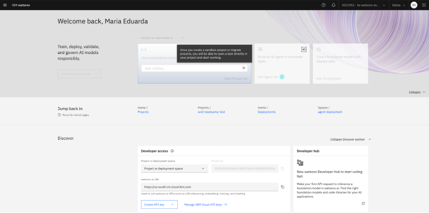
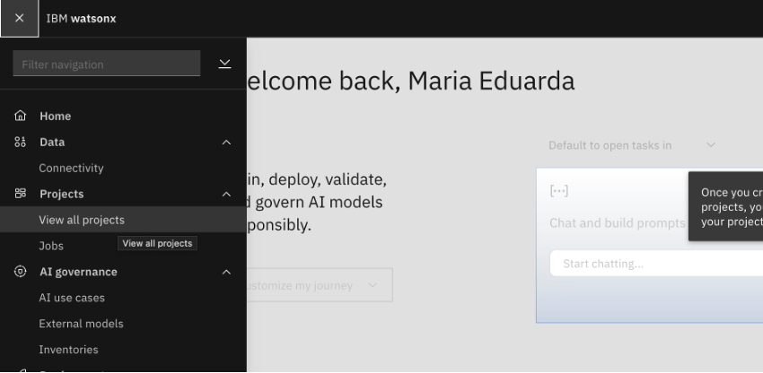
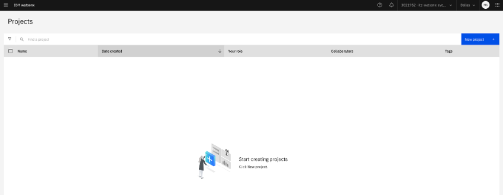
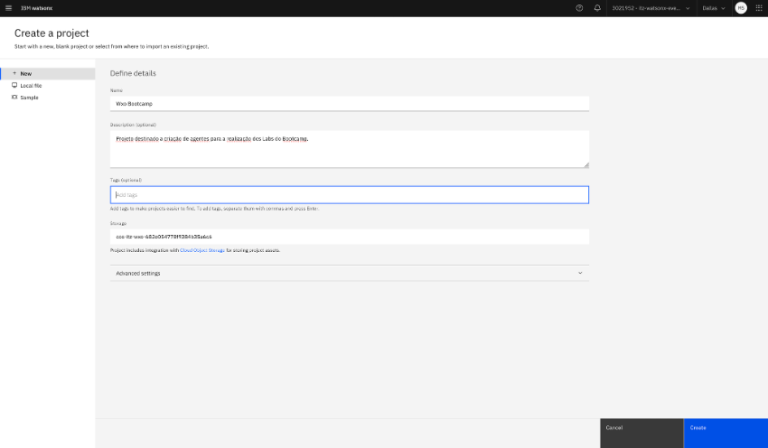

# Configuração do watsonx.ai para os laboratórios

Este procedimento é necessário para a perfeita execução dos laboratórios deste workshop.

Acesse a plataforma do [Watsonx.ai](https://dataplatform.cloud.ibm.com/). e faça logins com o seu IBM ID.

Se sua tela mostrar essa mensagem "Once you create a sandbox project..." execute as etapas abaixo. Caso contrário pode ignorar os procedimentos abaixo e seguinr para execução dos labs.

1- Clique no menu de nageção no alto a esquerda, clique em “Projects” e logo em seguida, clique em “View all projects”.

2- Dentro do espaço de projetos, clique no botão “create Project” que está demarcado na cor azul na interface.

3- Preencha os campos e clique no botão “Create”:
  - Name: Wxo Bootcamp
  - Description: opicional

Pronto! Agora você já pode implementar os Agentes necessário.

  
